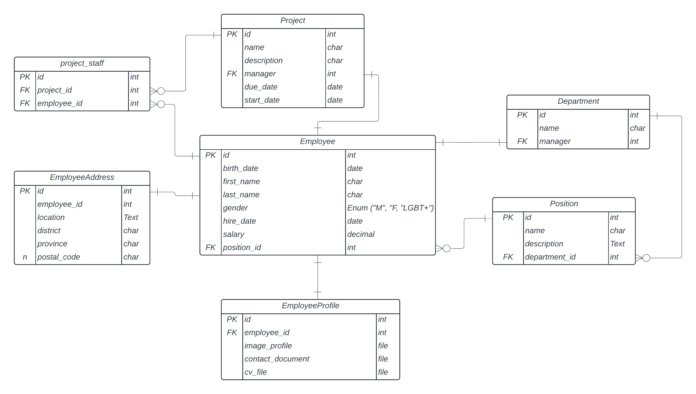
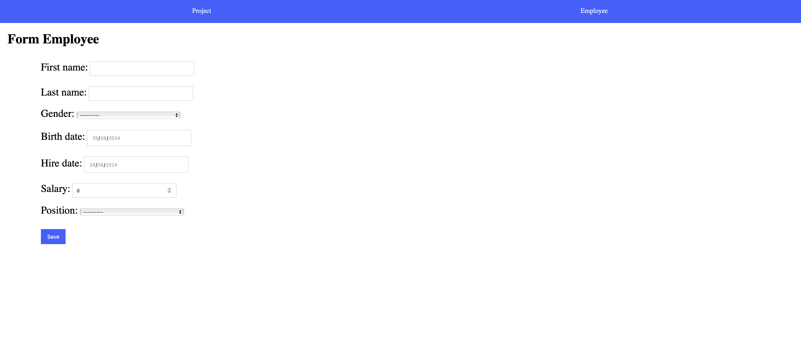
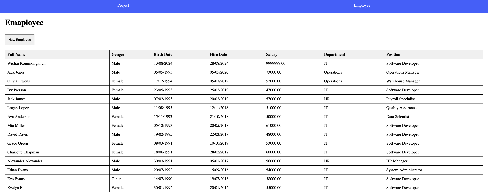

# WEEK 9 EXCERCISE



## Setup

- หากมี project ของ week 8 สามารถใช้ในการทำแบบฝึกหัดครังนี้ต่อได้ครับ (แก้ไขไฟล์ models.py ให้ copy code ข้างล่างไปใส่ที่ไฟล์ `employee/models.py`)
- ให้นักศึกษาลากโฟลเดอร์ templates ใน excercise ไปไว้ที่โฟลเดอร์ employee ขอโปรเจคนักศึกษา

    ```text
    templates/
        - employee.hmtl
        - employee_form.hmtl
        - layout.html
        - nav.html
        - position.html
        - project_detail.html
        - project_form.html
        - project.html
    ```

- ให้นักศึกษาลากโฟลเดอร์ static ใน excercise ไปใว้ในโฟลเดอร์ของโปรเจคนักศึกษา

    ```text
    static/
        - style.css
    ```

## EXERCISE: Employee Form

1. สร้าง class `EmployeeForm(forms.Form)` โดยให้มี field ดังนี้ (1 คะแนน)

    - first_name
    - last_name
    - gender
    - birth_date
    - hire_date
    - salary
    - position

    โดยให้คล้ายกับ model `Employee`

    ```python
    class Employee(models.Model):
        class Gender(models.Choices):
            M = "M"
            F = "F"
            LGBT = "LGBT"
            
        first_name = models.CharField(max_length=155)
        last_name = models.CharField(max_length=155)
        gender = models.CharField(max_length=10, choices=Gender.choices)
        birth_date = models.DateField()
        hire_date = models.DateField()
        salary = models.DecimalField(default=0, max_digits=10, decimal_places=2)
        position = models.ForeignKey(
            "employee.Position", 
            on_delete=models.SET_NULL, 
            null=True, 
            blank=True
        )
    ```

**Hint:** สังเกตว่ามี field ที่เป็นตัวเลือก (select) คือ Gender และ Position

สำหรับ `Gender` ควรใช้งาน `ChoiceField` ซึ่งมีตัวอย่างดังนี้

```python
from django import forms

class MyForm(forms.Form):
    AGE_CHOICES = (
        (1, 'Under 18'),
        (2, '19-24'),
        (3, '25-35'),
        (4, 'Older than 35')
    )

    age = forms.ChoiceField(
        choices=AGE_CHOICES
    )
```

สำหรับ `Position` ควรใช้งาน `ModelChoiceField` ซึ่งมีตัวอย่างดังนี้

```python
from django import forms
from .models import Developer

class MyForm(forms.Form):
    AGE_CHOICES = (
        (1, 'Under 18'),
        (2, '19-24'),
        (3, '25-35'),
        (4, 'Older than 35')
    )
    mentor = forms.ModelChoiceField(
        queryset=Developer.objects.filter(level=Developer.SENIOR)
    )
    age = forms.ChoiceField(
        choices=AGE_CHOICES
    )
```

**Hint:** สังเกตว่ามี field ที่เป็นการเลือกวันที่ (date picker) คือ Birthdate และ Hiredate

ควรใช้งาน `DateField` และ widget `DateInput` (สังเกตว่า Django จะ render `<input type="text">` แต่เราอยากได้เป็น `type=date`)

2. ในไฟล์ `employee.html` กำหนด path ให้กับปุ่ม "New Employee" ไปยังหน้า form เพิ่มข้อมูลพนักงานที่ไฟล์ `employee_form.html` แสดงผลหน้า form ถูกต้องดังภาพ (0.5 คะแนน)



3. เมื่อกด "Save" ในหน้า `employee_form.html` ให้บันทึกข้อมูลพนักงานใหม่ลงฐานข้อมูล หลังจากบันทึกสำเร็จให้ redirect กลับไปที่หน้าตารางพนักงาน โดยที่หน้าพนักงานเรียงข้อมูลจากวันที่เริ่มงาน (hire date) จากมากไปน้อย (0.5 คะแนน)


