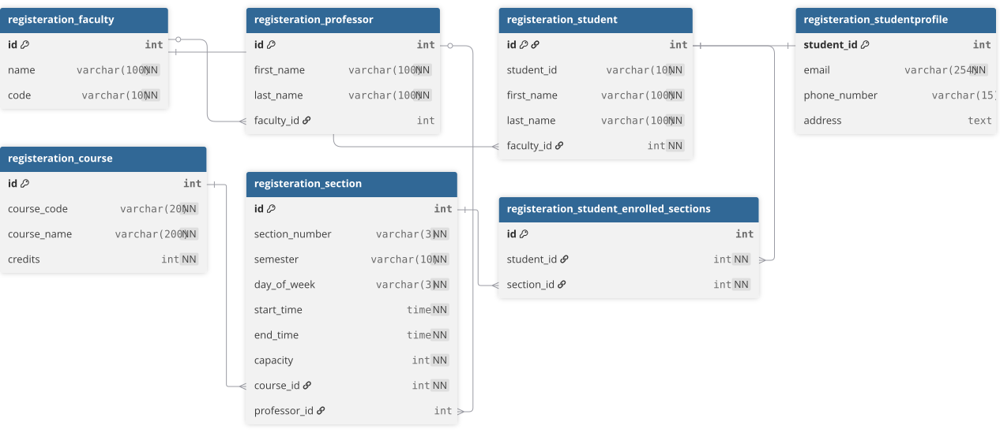
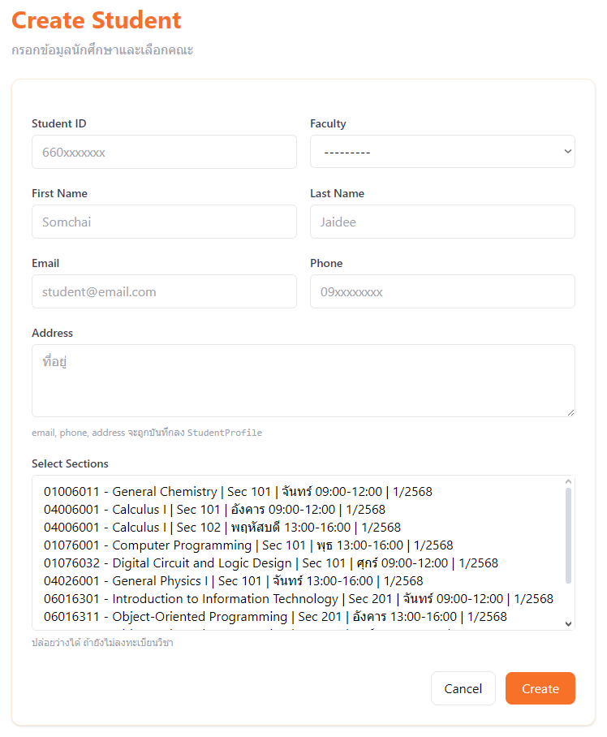
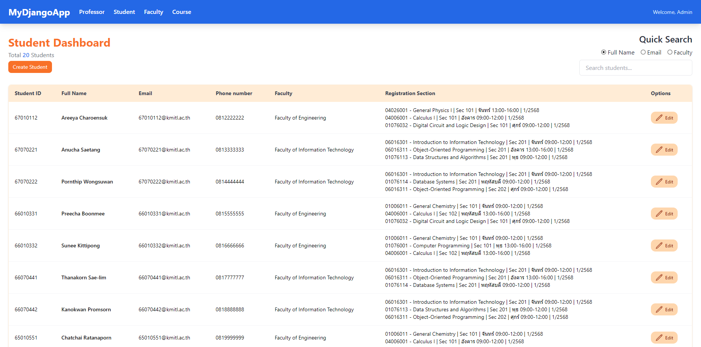
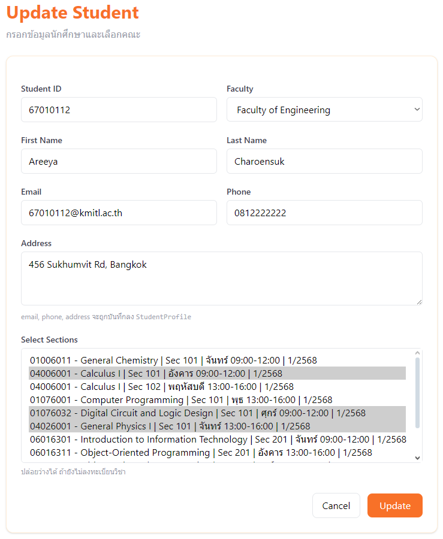

# WEEK 9 EXCERCISE



## Setup

- หากมี project ของ week 8 สามารถใช้ในการทำแบบฝึกหัดนี้ต่อได้เลยครับ (แก้ไขไฟล์ models.py ให้ copy code ข้างล่างไปใส่ที่ไฟล์ `models.py`)

    ```python
    from django.db import models


    class Faculty(models.Model):
        name = models.CharField(max_length=100, unique=True)
        code = models.CharField(max_length=10, unique=True)

        def __str__(self):
            return self.name


    class Professor(models.Model):
        first_name = models.CharField(max_length=100)
        last_name = models.CharField(max_length=100)
        faculty = models.ForeignKey(Faculty, on_delete=models.SET_NULL, null=True)

        def __str__(self):
            return f"{self.first_name} {self.last_name}"


    class Course(models.Model):
        course_code = models.CharField(max_length=20, unique=True)
        course_name = models.CharField(max_length=200)
        credits = models.PositiveSmallIntegerField()

        def __str__(self):
            return f"{self.course_code} {self.course_name}"


    class Section(models.Model):
        class DayOfWeek(models.TextChoices):
            MONDAY = "MON", "จันทร์"
            TUESDAY = "TUE", "อังคาร"
            WEDNESDAY = "WED", "พุธ"
            THURSDAY = "THU", "พฤหัสบดี"
            FRIDAY = "FRI", "ศุกร์"

        course = models.ForeignKey(Course, on_delete=models.CASCADE)
        section_number = models.CharField(max_length=3)
        semester = models.CharField(max_length=10)
        professor = models.ForeignKey(
            Professor, on_delete=models.SET_NULL, null=True, blank=True
        )
        day_of_week = models.CharField(max_length=3, choices=DayOfWeek.choices)
        start_time = models.TimeField()
        end_time = models.TimeField()
        capacity = models.PositiveSmallIntegerField(default=60)

        def __str__(self):
            return f"{self.course.course_code} - {self.course.course_name} | Sec {self.section_number} | {self.dayOfWeekThai()} {self.start_time.strftime("%H:%M")}-{self.end_time.strftime("%H:%M")} | {self.semester}"
            
        def dayOfWeek(self):
            weekday = {"MON": 0, "TUE": 1, "WED": 2, "THU": 3, "FRI": 4}
            return weekday[self.day_of_week]
        
        def dayOfWeekThai(self):
            weekday = {"MON": "จันทร์", "TUE": "อังคาร", "WED": "พุธ", "THU": "พฤหัสบดี", "FRI": "ศุกร์"}
            return weekday[self.day_of_week]


    class Student(models.Model):
        student_id = models.CharField(max_length=10, unique=True)
        first_name = models.CharField(max_length=100)
        last_name = models.CharField(max_length=100)
        faculty = models.ForeignKey(Faculty, on_delete=models.PROTECT)
        # ความสัมพันธ์จะถูกย้ายมาอยู่ที่นี่
        enrolled_sections = models.ManyToManyField(Section, blank=True)

        def __str__(self):
            return f"{self.student_id} - {self.first_name}"

        def get_full_name(self):
            return f"{self.first_name} - {self.last_name}"


    class StudentProfile(models.Model):
        student = models.OneToOneField(Student, on_delete=models.CASCADE, primary_key=True)
        email = models.EmailField(unique=True)
        phone_number = models.CharField(max_length=10, blank=True, null=True)
        address = models.TextField(blank=True, null=True)

        def __str__(self):
            return f"Profile of {self.student.first_name}"
    ```


- ให้นักศึกษาลากโฟลเดอร์ templates ใน excercise ไปไว้ที่โฟลเดอร์ employee ขอโปรเจคนักศึกษา

    ```text
    templates/
        - base.hmtl
        - course.hmtl
        - create_student.html
        - faculty.html
        - index.html
        - nav.html
        - professor.html
        - update_student.html
    ```

## EXERCISE: Student Form

1. สร้าง class `StudentForm(forms.Form)` โดยให้มี field ดังนี้ (1 คะแนน)

    - student_id
    - first_name
    - last_name
    - faculty
    - enrolled_sections
    - email
    - phone_number
    - address

    โดยให้คล้ายกับ model `Student` และ `StudentProfile`

    ```python
    class Student(models.Model):
        student_id = models.CharField(max_length=10, unique=True)
        first_name = models.CharField(max_length=100)
        last_name = models.CharField(max_length=100)
        faculty = models.ForeignKey(Faculty, on_delete=models.PROTECT)
        # ความสัมพันธ์จะถูกย้ายมาอยู่ที่นี่
        enrolled_sections = models.ManyToManyField(Section, blank=True)

        def __str__(self):
            return f"{self.student_id} - {self.first_name}"


    class StudentProfile(models.Model):
        student = models.OneToOneField(Student, on_delete=models.CASCADE, primary_key=True)
        email = models.EmailField(unique=True)
        phone_number = models.CharField(max_length=10, blank=True, null=True)
        address = models.TextField(blank=True, null=True)

        def __str__(self):
            return f"Profile of {self.student.first_name}"
    ```

    **Hint:** สังเกตว่ามี field ที่เป็นตัวเลือก คือ Faculty (select) และ Enrolled Sections (select multiple)

    สำหรับ `faculty` ควรใช้งาน `ModelChoiceField` ซึ่งมีตัวอย่างดังนี้

    ```python
    from django import forms
    from .models import MyModel

    class MyForm(forms.Form):
        my_field = forms.ModelChoiceField(
            queryset=MyModel.objects.all(),
            empty_label="Select an option",
            required=False
        )
    ```

    สำหรับ `enrolled_sections` ควรใช้งาน `ModelMultipleChoiceField` ซึ่งมีตัวอย่างดังนี้

    ```python
    from django import forms
    from .models import MyModel

    class MyForm(forms.Form):
        my_multiple_field = forms.ModelMultipleChoiceField(
            queryset=MyModel.objects.all(),
            required=False,
        )
    ```

2. ในไฟล์ `index.html` กำหนด path ให้กับปุ่ม "Create Student" ไปยังหน้า form เพิ่มข้อมูลนักศึกษาที่ไฟล์ `create_student.html` แสดงผลหน้า form ถูกต้องดังภาพ (0.25 คะแนน)

    

3. เมื่อกด "Create" ในหน้า `create_student.html` ให้บันทึกข้อมูลนักศึกษาใหม่ลงฐานข้อมูล หลังจากบันทึกสำเร็จให้ redirect กลับไปที่หน้าตารางพนักงาน (0.5 คะแนน)

    

4. ในไฟล์ `index.html` กำหนด path ให้กับปุ่ม "Edit" ของแต่ละข้อมูลของนักศึกษา เพื่อไปยังหน้า form แก้ไขข้อมูลนักศึกษาที่ไฟล์ `update_student.html` แสดงผลหน้า form ถูกต้องดังภาพ (0.25 คะแนน)

    

5. เมื่อกด "Update" ในหน้า `update_student.html` ให้บันทึกข้อมูลนักศึกษาที่ถูกแก้ไขใหม่ลงฐานข้อมูล หลังจากบันทึกสำเร็จให้ redirect กลับไปที่หน้าตารางพนักงาน (0.5 คะแนน)

    

6. ลองปรับใช้ widget (0.5)
    - Field `faculty` เป็น radio button โดยใช้ widget `RadioSelect` [ref](https://docs.djangoproject.com/en/5.2/ref/forms/widgets/#radioselect) 
    - Field `address` เป็น textarea โดยใช้ widget `Textarea` [ref](https://docs.djangoproject.com/en/5.2/ref/forms/widgets/#textarea)
