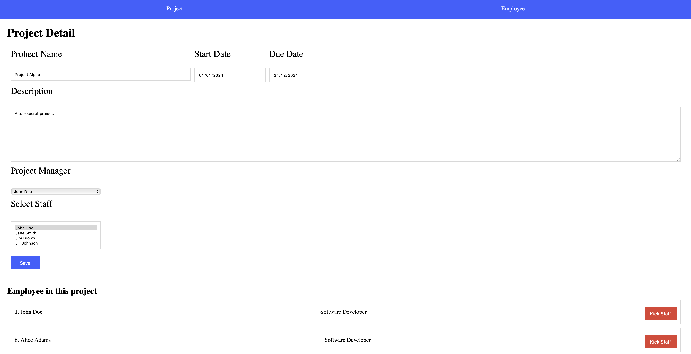

# WEEK 9 EXCERCISE


## Setup
> หากมี project ของ week 8 สามารถใช้ในการทำแบบฝึกหัดครังนี้ต่อได้ครับ (แก้ไขไฟล์ models.py)

1. สร้าง project ชื่อ `employee_management`
2. สร้าง database ใหม่ชื่อ `employee_db`
4. ให้ทำการ startapp ชื่อ `employee`
5. ให้ copy code ข้างล่างไปใส่ที่ไฟล์ `employee/models.py`

``` PYTHON
    from django.db import models

    class Employee(models.Model):
        class Gender(models.TextChoices):
            M = "M", "Male"
            F = "F", "Female"
            LGBT = "LGBT", "LGBT"
            
        first_name = models.CharField(max_length=155)
        last_name = models.CharField(max_length=155)
        gender = models.CharField(max_length=10, choices=Gender.choices)
        birth_date = models.DateField()
        hire_date = models.DateField()
        salary = models.DecimalField(default=0, max_digits=10, decimal_places=2)
        position = models.ForeignKey(
            "employee.Position", 
            on_delete=models.SET_NULL, 
            null=True, 
            blank=True
        )
        
        def get_full_name(self):
            return f"{self.first_name} {self.last_name}"
        
        def __str__(self) -> str:
            return self.get_full_name()
        
    class EmployeeAddress(models.Model):
        employee = models.OneToOneField("employee.Employee", on_delete=models.PROTECT)
        location = models.TextField(null=True, blank=True)
        district = models.CharField(max_length=100)
        province = models.CharField(max_length=100)
        postal_code = models.CharField(max_length=15)
        
        
    class Department(models.Model):
        name = models.CharField(max_length=155)
        manager = models.OneToOneField(
            "employee.Employee", 
            on_delete=models.SET_NULL, 
            null=True, 
            blank=True
        )
        
        
    class Position(models.Model):
        name = models.CharField(max_length=155)
        description = models.TextField(null=True, blank=True)
        department = models.ForeignKey(
            "employee.Department",
            on_delete=models.SET_NULL, 
            null=True, 
            blank=True
        )
        
        def __str__(self):
            return str(self.name)


    class Project(models.Model):
        name = models.CharField(max_length=255, unique=True)
        description = models.TextField(null=True, blank=True)
        manager = models.OneToOneField(
            "employee.Employee", 
            on_delete=models.SET_NULL, 
            null=True, 
            blank=True,
            related_name="project_mamager"
        )
        due_date = models.DateField()
        start_date = models.DateField()
        staff = models.ManyToManyField("employee.Employee")
        
        def __str__(self):
            return str(self.name)
        
```

6. ให้ทำการ makemigrations และ migrate
7. ให้นักศึกษาลากโฟลเดอร์ templates ใน excercise ไปไว้ที่โฟลเดอร์ employee ขอโปรเจคนักศึกษา
    ```
    templates/
        - employee.hmtl
        - employee_form.hmtl
        - layout.html
        - nav.html
        - position.html
        - project_detail.html
        - project_form.html
        - project.html
    ```
8. ให้นักศึกษาลากโฟลเดอร์ static ใน excercise ไปใว้ในโฟลเดอร์ของโปรเจคนักศึกษา
    ```
    static/
        - style.css
    ```

## 1. FORM EMPLOYEE

1.1 กำหนด path ให้กับปุ่ม New Employee ไปยังหน้า form เพิ่มข้อมูลพนักงานที่ไฟล์ `employee_form.html` แสดงผลหน้า form ถูกต้องดังภาพ


1.2 บันทึกข้อมูลพนักงาน หลังจากบันทึกสำเร็จให้ redirect กลับไปที่หน้าตารางพนักงาน โดยที่หน้าพนักงานเรียงข้อมูลจากวันที่เริ่มงาน (hire date)


## 2. FORM PROJECT

2.1 กำหนด path ให้กดปุ่ม New Project ไปยังหน้า form สำหรับเพิ่มข้อมูล Project `project_form.html` แสดงหน้า form ให้ถูกต้องดังภาพ


2.2 บันทึกข้อมูลโปรเจคใหม่ หลังจากยันทึกสำเร็จให้ redirect กลับไปที่หน้า project list


2.3 เมื่อกดปุ่มแก้ไขที่หน้าให้ ไปยังหน้า project detail และแสดงผล Form สำหรับแก้ไขข้อมูลโปรเจคดังภาพ



2.4 เมื่อกดปุ่ม Save ให้ทำการแก้ไขข้อมูล project และสามารถเพิ่มพนักงานเข้ามาใน Project ได้ หลังจากแก้ไขให้ redirect กลับมาหน้าเดิมพร้อมแสดงข้อมูลที่ถูกแก้ไข
