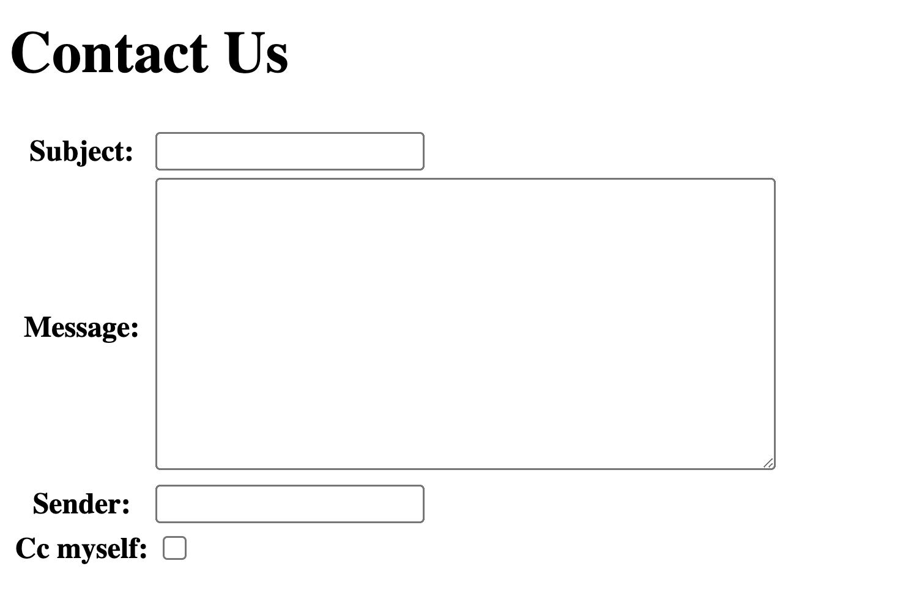

# Working with form templates

วิธีที่ง่ายที่สุดในการ render form ในไฟล์ HTML คือการ render ตัวแปร `{{form}}` ที่ถูกส่งมาใน context

เรามาลอง render `ContactForm` ตามขั้นตอนดังนี้กัน

1. สร้าง app `contact`
2. นำ code ของ class `ContactForm` ไปไว้ในไฟล์ `contact/forms.py`

```python
from django import forms

class ContactForm(forms.Form):
    subject = forms.CharField(max_length=100)
    message = forms.CharField(widget=forms.Textarea)
    sender = forms.EmailField()
    cc_myself = forms.BooleanField(required=False)
```

3. สร้าง view สำหรับ render form อันนี้ โดยนำ code ด้านล่างไปใส่ในไฟล์ `contact/views.py`

```python
from django.http import HttpResponse
from django.shortcuts import render, redirect

from contact.forms import ContactForm

def contact_us(request):

    if request.method == "POST":
        # bind data to form
        form = ContactForm(request.POST)
        # validate data in the form
        if form.is_valid():
            # access cleaned_data
            subject = form.cleaned_data["subject"]
            message = form.cleaned_data["message"]
            sender = form.cleaned_data["sender"]
            cc_myself = form.cleaned_data["cc_myself"]

            print("Subject", subject)
            print("Message", message)
            print("Sender", sender)
            print("CC myself?", cc_myself)

            # Assume that this view send email
            # recipients = ["info@example.com"]
            # if cc_myself:
            #     recipients.append(sender)

            # send_mail(subject, message, sender, recipients)

            # redirect to "thanks" page when the email has been sent
            return redirect("thanks")
    else:
        form = ContactForm()
    
    return render(request, "contact_us.html", {"form": form})

def thanks(request):
    return HttpResponse("THANKS!!!")
```

4. กำหนด path ใน `urls.py` ให้ชี้มาที่ view นี้

`week9_tutorial/urls.py` -> ไฟล์ urls.py ไฟล์หลัก

```python
from django.contrib import admin
from django.urls import path, include

urlpatterns = [
    path("admin/", admin.site.urls),
    path("myform/", include("myform.urls"))
    path("contact/", include("contact.urls"))
]
```

`contact/urls.py`

```python
from django.urls import path

from contact import views

urlpatterns = [
    path("", views.contact_us, name="contact_us"),
    path("thanks/", views.thanks, name="thanks"),
]
```

5. เพิ่มไฟล์ `contact_us.html` ใน `contact/templates/`

```html
<!DOCTYPE html>
<html lang="en">
<head>
    <meta charset="UTF-8">
    <meta name="viewport" content="width=device-width, initial-scale=1.0">
    <title>Contact Us Form</title>
</head>
<body>
    <h1>Contact Us</h1>
    <form method="POST">
        
    <table>
        {{form.as_table}}
    </table>
    <p>
        <input type="submit" value="Submit">
    </p>
    </form>
</body>
</html>
```

6. สั่ง runserver และเปิดหน้าฟอร์มที่ `http://127.0.0.1:8000/contact/`



เมื่อลอง view pagr source ของไฟล์ HTML จะได้ดังนี้

```html
<!DOCTYPE html>
<html lang="en">
<head>
    <meta charset="UTF-8">
    <meta name="viewport" content="width=device-width, initial-scale=1.0">
    <title>Contact Us Form</title>
</head>
<body>
    <h1>Contact Us</h1>
    <form method="POST">
    <table>
        <tr>
    <th><label for="id_subject">Subject:</label></th>
    <td>
      <input type="text" name="subject" maxlength="100" required id="id_subject"> 
    </td>
  </tr>

  <tr>
    <th><label for="id_message">Message:</label></th>
    <td>
      <textarea name="message" cols="40" rows="10" required id="id_message"></textarea>
    </td>
  </tr>

  <tr>
    <th><label for="id_sender">Sender:</label></th>
    <td>
      <input type="email" name="sender" maxlength="320" required id="id_sender">
    </td>
  </tr>

  <tr>
    <th><label for="id_cc_myself">Cc myself:</label></th>
    <td>
      <input type="checkbox" name="cc_myself" id="id_cc_myself">
    </td>
  </tr>
    </table>
    <p>
        <input type="submit" value="Submit">
    </p>
    </form>
</body>
</html>
```

## Rendering fields manually

ในกรณีที่ต้องการควบคุม UX UI ของ form เอง เราก็สามารถทำได้ ยกตัวอย่างเช่น

```html
{{ form.non_field_errors }}
<div class="fieldWrapper">
    {{ form.subject.errors }}
    <label for="{{ form.subject.id_for_label }}">Email subject:</label>
    {{ form.subject }}
</div>
<div class="fieldWrapper">
    {{ form.message.errors }}
    <label for="{{ form.message.id_for_label }}">Your message:</label>
    {{ form.message }}
</div>
<div class="fieldWrapper">
    {{ form.sender.errors }}
    <label for="{{ form.sender.id_for_label }}">Your email address:</label>
    {{ form.sender }}
</div>
<div class="fieldWrapper">
    {{ form.cc_myself.errors }}
    <label for="{{ form.cc_myself.id_for_label }}">CC yourself?</label>
    {{ form.cc_myself }}
</div>
```

หรือจะสั้นลงมาโดยใช้ `label_tag`

```html
<div class="fieldWrapper">
    {{ form.subject.errors }}
    {{ form.subject.label_tag }}
    {{ form.subject }}
</div>
```

โดย field ของ form จะมี attribute ที่สามารถใช้ได้ดังนี้

- {{ field.errors }}
- {{ field.value }}
- {{ field.help_text }}
- {{ field.html_name }}
- {{ field.auto_id }}
- {{ field.id_for_label }}
- {{ field.is_hidden }}
- {{ field.label }}
- {{ field.label_tag }}

```html
<label for="id_email">Email address:</label>
```

นอกจากนั้นเรายังสามารถ loop เข้าไปแต่ละ field ใน form ได้ ดังตัวอย่าง

```html

    <div class="fieldWrapper">
        {{ field.errors }}
        {{ field.label_tag }} {{ field }}
        
          <p class="help" id="{{ field.auto_id }}_helptext">
            {{ field.help_text|safe }}
          </p>
        
    </div>

```
